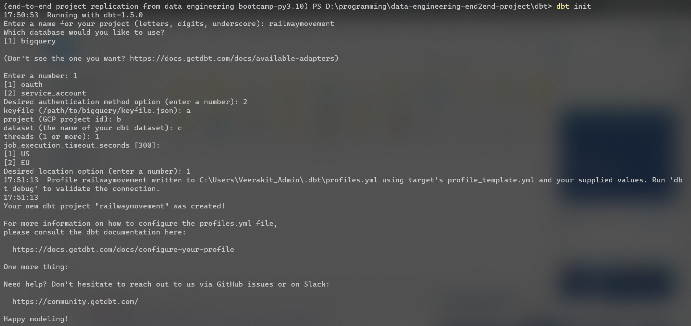

# Scheduling dbt with Airflow

## Reference for more detailed instruction 

[zkan's instruction](https://zkan.notion.site/Day-6-Workshop-Instruction-3cd604c28cd546789648850d3ec3d063)

## Getting Started

Before we run Airflow, let's create these folders first:

```sh
mkdir -p ./dags ./logs ./plugins ./tests
```

On **Linux**, please make sure to configure the Airflow user for the docker-compose:

```sh
echo -e "AIRFLOW_UID=$(id -u)" > .env
```

Copy the content in the `env.extra` file to the `.env` file, so that the `.env` file will look similar to this:

```
AIRFLOW_UID=501
_PIP_ADDITIONAL_REQUIREMENTS=astronomer-cosmos==0.6.5 dbt-core==1.5.0 dbt-bigquery==1.5.0
```

## Google Cloud Connection

For the Keyfile JSON, we'll copy the content in the keyfile and paste to it.


## Setup Instruction

### Step 1: Install dependencies
To start the project, first install the dependencies using Poetry Package Manager with:

```sh
poetry install
```

There are 2 options for executing commands for Airflow and dbt.

Option 1: 

Using `poetry run` to run commands from existing environment.

```sh
poetry run {command} [Option]

# Example
poetry run dbt run
```

Option 2:

Enter Poetry virtual environment using `poetry shell`. Then, any Airflow or dbt commands can be run without stating `poetry run`.

```sh
$ poetry shell
(virtual-env) $ dbt run
```
### Step 2: Spinning up Airflow instance

Spin up the Airflow containers service using Docker Compose.

Normally, it should be building the images first, then spining up the containers, but `docker compose up` will automatically build images if none exists.

```sh
$ docker compose up
```

Wait until the Airflow Scheduler says that it is up and running in host [http://0.0.0.0:8080](http://0.0.0.0:8080), or [http://localhost:8080](http://localhost:8080), and then it can be access through the browser via the previous host.

The default username and password are defined at this location in `docker-compose.yml` file.

```
username=airflow
password=airflow
```


### Step 3: Setting up dbt 

The dbt dependencies is already defined in the `pyproject.toml` config, so once we install the Python dependencies, the dbt libraries will be installed along.

Install the dependencies in Poetry configuration.

```sh
$ poetry install
```

Then initialize the dbt project with either of commands.

```sh
$ dbt init
# or
$ poetry run dbt init
```

When prompted for the project name, enter it. In this case let's use `railwaymovement`. 

Then, select the appropriate 3rd parties tool, here a BigQuery. Then, select auth method, here service account method. 

After that, put in random things or default value to continue, because we can change it later in a profile configuration file.



If there is error raised about C:/Users/{USER}/.dbt/profiles.yml not found, just create it, for both the directory and file.

Then the dbt is ready to use, try run the following command to verify it.

```sh
# navigate into the dbt project directory.
# /dbt/railwaymovement/.
$ dbt debug
```


## Replicate workflow

After finished setting up the instances, execute into the Airflow Scheduler to execute backfilling operation. 
Because the data only exists in a period of time in the past.
```sh
# Can check Airflow Scheduler container ID with following
# And look for `CONTAINER ID` of airflow-scheduler
$ docker ps 

# Get into the Airflow Scheduler instance
$ docker exec -it {Airflow Scheduler container ID} bash
```

Once inside the container instance, run the following command to backfil the data, running the DAG with past date.
Where the date that contains data is from 24-05-2023 to 27-05-2023
```sh
airflow dags backfill -s {YYYY-MM-DD start-date} -e {YYYY-MM-DD end-date} {dag_id} --reset-dagruns

# Actual commandd
airflow dags backfill -s 24-05-2023 -e 27-05-2023 {dag_id} --reset-dagruns
``` 